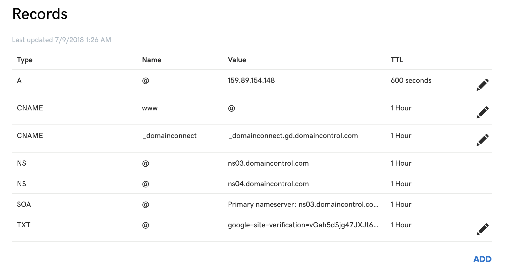

# Digital Ocean coupons and setup instructions

Digital ocean is a service that provides you a virtual server that runs 24x7. This server has certain things installed and ready to go, but a few things we need to set up ourselves.

**TABLE OF CONTENTS**

<ol> 
    <li><a href="#digital-ocean-coupons">Digital Ocean Coupons</a></li>
    <li><a href="#initial-server-setup">Initial Server Setup</a></li>
        <ul>
            <li><a href="#step-one----root-login">Root Login</a></li>
            <li><a href="#step-two--create-a-new-user">Create a New User</a></li>
            <li><a href="#step-three--root-privileges">Root Privileges</a></li>
            <li><a href="#step-four--add-public-key-authentication-recommended">Add Public Key Authentication (Recommended)</a></li>
            <li><a href="#step-five--test-log-in">Test Login</a></li>
            <li><a href="#step-seven--set-up-a-basic-firewall">Set Up a Basic Firewall</a></li>
        </ul>
    <li><a href='#setup-domain-name-to-be-used-with-application'>Setup domain name to be used with Application</a></li>
    <li><a href='#how-to-install-nginx'>How To Install Nginx</a></li>
</ol>

# Digital Ocean Coupons
<ol>
    <li>First open this <a href='https://m.do.co/c/14d81c9a2d3a'>link</a> and Sign Up to get your $10 credit.</li>
    <li>While filling your billing info, click on "Have a Promo Code?" at the bottom of the page.</li>
    <li>Enter any one of the below codes to get extra credit:</li>
</ol>

<ul>
    <li>CodeAnywhere10</li>
    <li>LOWENDBOX</li>
    <li>CODEANYWHERE</li>
    <li>DOPRODUCT15</li>
    <li>DO10</li>
    <li>ALLSSD10</li>
    <li>WP10</li>
    <li>DROPLET10</li>
    <li>BITNAMI</li>
    <li>DEPLOY10</li>
    <li>ACTIVATE10</li>
    <li>DONEWS</li>
    <li>FRANKFURT</li>
</ul>

<strong>these instructions were selectively copied from the relevant portions of digital ocean's documentations</strong>


# Initial Server Setup

## Step One -- Root Login

if you are not already connected to your server, go ahead and log in as the root user using the following command (substitute the highlighted word with your server's public IP address):

``` bash
ssh root@your_server_ip
```

## Step Two — Create a New User
Once you are logged in as root, we're prepared to add the new user account that we will use to log in from now on.

This example creates a new user called "devmountain", but you should replace it with a username that you like:

```bash
adduser devmountain
```

## Step Three — Root Privileges

Now, we have a new user account with regular account privileges. However, we may sometimes need to do administrative tasks.

To avoid having to log out of our normal user and log back in as the root account, we can set up what is known as "superuser" or root privileges for our normal account. This will allow our normal user to run commands with administrative privileges by putting the word sudo before each command.

As root, run this command to add your new user to the sudo group (substitute the highlighted word with your new user):

```bash
usermod -aG sudo devmountain
```

## Step Four — Add Public Key Authentication (Recommended)

The next step in securing your server is to set up public key authentication for your new user. Setting this up will increase the security of your server by requiring a private SSH key to log in.

### Generate a Key Pair
If you do not already have an SSH key pair, which consists of a public and private key, you need to generate one. If you already have a key that you want to use, skip to the Copy the Public Key step.

To generate a new key pair, enter the following command at the terminal of your local machine (ie. your computer):

```bash
ssh-keygen
```

Assuming your local user is called "localuser", you will see output that looks like the following:

```bash
ssh-keygen output
Generating public/private rsa key pair.
Enter file in which to save the key (/Users/localuser/.ssh/id_rsa):
Hit return to accept this file name and path (or enter a new name).
```

Next, you will be prompted for a passphrase to secure the key with. You may either enter a passphrase or leave the passphrase blank.

This generates a private key, id_rsa, and a public key, id_rsa.pub, in the .ssh directory of the localuser's home directory. Remember that the private key should not be shared with anyone who should not have access to your servers!

### Copy the Public Key

use the following command at the terminal of your local machine to print your public key (id_rsa.pub):

```bash
cat ~/.ssh/id_rsa.pub
```

This should print your public SSH key, which should look something like the following:

```bash
id_rsa.pub contents
ssh-rsa AAAAB3NzaC1yc2EAAAADAQABAAABAQDBGTO0tsVejssuaYR5R3Y/i73SppJAhme1dH7W2c47d4gOqB4izP0+fRLfvbz/tnXFz4iOP/H6eCV05hqUhF+KYRxt9Y8tVMrpDZR2l75o6+xSbUOMu6xN+uVF0T9XzKcxmzTmnV7Na5up3QM3DoSRYX/EP3utr2+zAqpJIfKPLdA74w7g56oYWI9blpnpzxkEd3edVJOivUkpZ4JoenWManvIaSdMTJXMy3MtlQhva+j9CgguyVbUkdzK9KKEuah+pFZvaugtebsU+bllPTB0nlXGIJk98Ie9ZtxuY3nCKneB+KjKiXrAvXUPCI9mWkYS/1rggpFmu3HbXBnWSUdf localuser@machine.local
```

Select the public key, and copy it to your clipboard.

### Paste Public Key to the Server

On the server, as the root user, enter the following command to temporarily switch to the new user (substitute your own user name):

```bash
su devmountain
```

Now you will be in your new user's home directory.

Create a new directory called .ssh and restrict its permissions with the following commands:

```bash
mkdir ~/.ssh
chmod 700 ~/.ssh
```

Now open a file in .ssh called authorized_keys with a text editor. We will use nano to edit the file:

```bash
nano ~/.ssh/authorized_keys
```

Now insert your public key (which should be in your clipboard) by pasting it into the editor.

Hit CTRL-x to exit the file, then y to save the changes that you made, then ENTER to confirm the file name.

Now restrict the permissions of the authorized_keys file with this command:

```bash
chmod 600 ~/.ssh/authorized_keys
```

Type this command once to return to the root user:

```bash
exit
```

Now your public key is installed, and you can use SSH keys to log in as your user.

## Step Five — Test Log In

In a new terminal on your local machine, log in to your server using the new account that we created. To do so, use this command (substitute your username and server IP address):

```bash
ssh devmountain@your_server_ip
```

## Step Six — Set Up a Basic Firewall

We need to make sure that the firewall allows SSH connections so that we can log back in next time. We can allow these connections by typing:

```bash
sudo ufw allow OpenSSH
```
Then type 
```bash
sudo ufw enable
```

# Setup domain name to be used with Application

This part can be done from any domain name provider (e.g. GoDaddy, NameCheap, Google Domais) but we will use GoDaddy

First go to GoDaddy and purchase the domain name of your choice, you can google for a 99 cent coupon or try one of these

* GPPT02K500
* CJCCOUP99
* CJCRMNCA99
* MMANUTS99
* CJC99R

After purchasing your domain name, you will need to Navagate to the DNS records of your new site

The only thing you will need to update here is the A record, for GoDaddy, you should see something like this 



Simply change your A records Value column to your digital ocean server IP address 

Simple as that, it can take up to 48 hours for your domain name to propagate through DNS, this is usually rarely the case however and should update within 10 minutes or so

# How To Install Nginx

Nginx is one of the most popular web servers in the world and is responsible for hosting some of the largest and highest-traffic sites on the internet. It is more resource-friendly than Apache in most cases and can be used as a web server or a reverse proxy.

## Step 1: Install Nginx

We need tp update our local package index so that we have access to the most recent package listings. Afterwards, we can install Nginx:

```bash
sudo apt-get update
sudo apt-get install nginx
```

## Step 2: Adjust the Firewall

Before we can test Nginx, we need to reconfigure our firewall software to allow access to the service. 

You can enable this by trying

```bash
sudo ufw allow 'Nginx Full'
```

# Set Up Node.js Application for Production

## Install Node.js
We will install the latest LTS release of Node.js, using the NodeSource package archives.

We can download this script by typing
```bash
curl -sL https://deb.nodesource.com/setup_10.x -o nodesource_setup.sh
```

And run the script under sudo:

```bash
sudo bash nodesource_setup.sh
```

After running the setup script from nodesource, you can install the Node.js package:

```bash
sudo apt-get install nodejs
```

The nodejs package contains the nodejs binary as well as npm, so you don't need to install npm separately. However, in order for some npm packages to work (such as those that require compiling code from source), you will need to install the build-essential package:

```bash
sudo apt-get install build-essential
```

The Node.js runtime is now installed, and ready to run an application!

## Install PM2
Now we will install PM2, which is a process manager for Node.js applications. PM2 provides an easy way to manage and daemonize applications (run them in the background as a service).

Use this command to install PM2:

```bash
sudo npm install -g pm2
```

The startup subcommand generates and configures a startup script to launch PM2 and its managed processes on server boots:

```bash
pm2 startup systemd
```

## Set Up Nginx as a Reverse Proxy Server

Earlier We set up Nginx

we are going to edit the /etc/nginx/sites-available/default file. Open the file for editing:

```bash
sudo nano /etc/nginx/sites-available/default
```

Here you can simply delete everything from this file and past this in 

```bash
server {
listen 80;
    return 301 https://$host$request_uri;
}
server {
    server_name example.com www.example.com; #PUT YOUR DOMAIN HERE
	
    location / {
        proxy_pass http://127.0.0.1:4000; #PUT YOUR SERVER PORT HERE
        proxy_http_version 1.1;
        proxy_set_header Upgrade $http_upgrade;
        proxy_set_header Connection 'upgrade';
        proxy_set_header Host $host;
        proxy_cache_bypass $http_upgrade;
    }
}
```
Remember to replace the appropriate values with your information (Ie. domain name, server port)

Make sure you didn't introduce any syntax errors by typing:

```bash
sudo nginx -t
```

Next, restart Nginx

```bash
sudo systemctl restart nginx
```


# Secure Nginx with Let's Encrypt (HTTPS)

Let's Encrypt is a Certificate Authority (CA) that provides an easy way to obtain and install free TLS/SSL certificates, thereby enabling encrypted HTTPS on web servers.

## Step 1 — install certbot
lets add the CertBot repository to ensure we have the most up to date CertBot version, you can do this by typing

```bash
sudo add-apt-repository ppa:certbot/certbot
```
You'll need to press `ENTER` to accept. Then, update the package list to pick up the new repository's package information.

```bash
sudo apt-get update
```

And finally, install Certbot's Nginx package with `apt-get`.

```bash
sudo apt-get install python-certbot-nginx
```

## Step 2 — Obtaining an SSL Certificate

Certbot provides a variety of ways to obtain SSL certificates, through various plugins. The Nginx plugin will take care of reconfiguring Nginx and reloading the config whenever necessary:

(remember to update the values with your domain name)
```bash
sudo certbot --nginx -d example.com -d www.example.com
```

If this is your first time running certbot, you will be prompted to enter an email address and agree to the terms of service. After doing so, certbot will communicate with the Let's Encrypt server, then run a challenge to verify that you control the domain you're requesting a certificate for.

If that's successful, certbot will ask how you'd like to configure your HTTPS settings.


```
Please choose whether or not to redirect HTTP traffic to HTTPS, removing HTTP access.
-------------------------------------------------------------------------------
1: No redirect - Make no further changes to the webserver configuration.
2: Redirect - Make all requests redirect to secure HTTPS access. Choose this for
new sites, or if you're confident your site works on HTTPS. You can undo this
change by editing your web server's configuration.
-------------------------------------------------------------------------------
Select the appropriate number [1-2] then [enter] (press 'c' to cancel):
```

Select option 2 and press `ENTER`. The configuration will be updated, and Nginx will reload to pick up the new settings. certbot will wrap up with a message telling you the process was successful and where your certificates are stored

# Launching your Express/React App (create-react-app)

## Step 1 — Prepare Application server file

We need to add a few lines to our server to make sure we are serving the correct files as well as have the correct fallback in place incase a resource isnt found

first you will add the following line to your `server/index.js` file before any of your routes

```js
app.use( express.static( `${__dirname}/../build` ) );
```

At the end of your server file after all of your routes, add the following lines

```js
const path = require('path')
app.get('*', (req, res)=>{
  res.sendFile(path.join(__dirname, '../build/index.html'));
})
```
Its always a good idea to test your production ready app before launching it on the server, if you would like to make sure everything functions properly, simply run `npm run build` and start your server on whichever port you specified.

Now go to `http://localhost:(your port number)`

If your app is running as expected, you can commit it and push it to GitHub

## Step 2 — Set up app on server

log into your server as the user you setup in the beginning by typing

(make sure to you your username and server IP)
```bash
ssh devmountain@your_server_ip
```

make sure your are in the root folder for your user by typing `cd` and pressing `ENTER`

you can now `git clone` your repository

because you added the .env to your .gitignore while developing, you will need to make a new `.env` so that we can store our passwords and keys on the server. To do this,
`cd` into your project's directory and make a new .env by running the following command

```bash
nano .env
```

this will simultaneously create a new file called `.env` and open that file in the nano text editor.

At this point you can just copy your passwords and keys from your development servers `.env` to your servers newly created `.env`

Hit `CTRL-x` to exit the file, then y to save the changes that you made, then ENTER to confirm the file name.

run the following commands
```bash
npm install
npm run build
```

## Step 3 - Start App

We can do a test run on our application on the server to make sure we can access the application from the browser

to do this run
```bash
node path/to/server/file
```

after running this as long as no error show in the terminal, then you can try an access your site from a browser using the domain name you registered.

If everything is working as expected, we can now kill the node process running our server by typing `ctrl-x` in the terminal

after killing the node process, you can now start up PM2 which we installed earlier, and that will run our website after we have logged out of our server.

to do this, run the following command

```bash
pm2 start path/to/server/file
```

Check to make sure your site is accessible again in the browser, if everything is working, you can now type `exit` in your terminal to log out

Congrats you have a fully functioning production ready app!

if you have questions, feel free to email me: joshborup@gmail.com